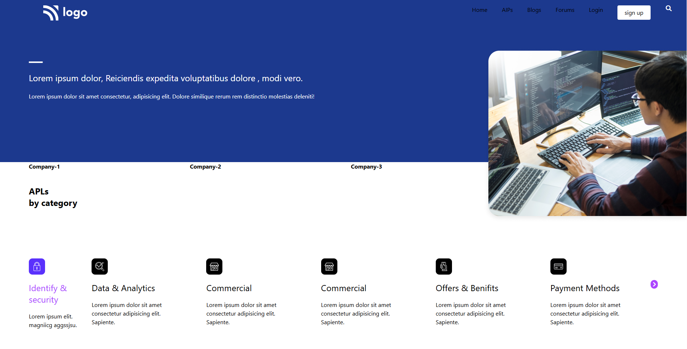
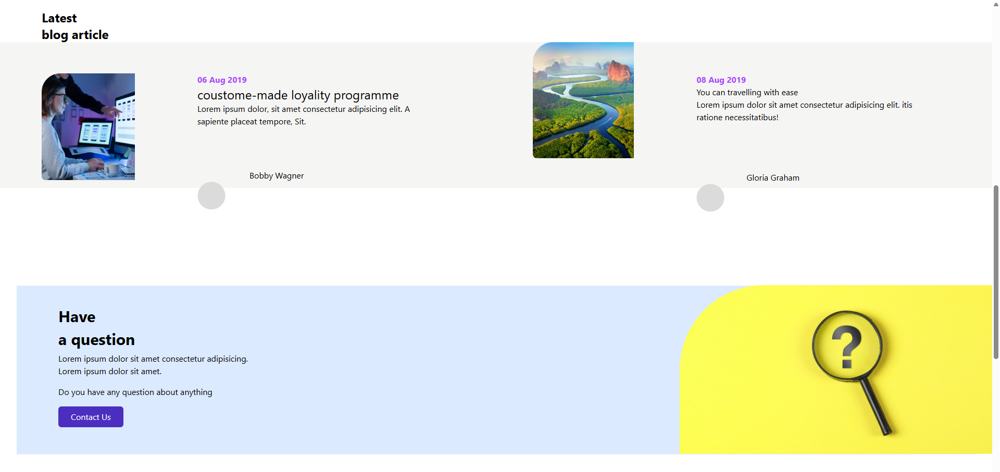
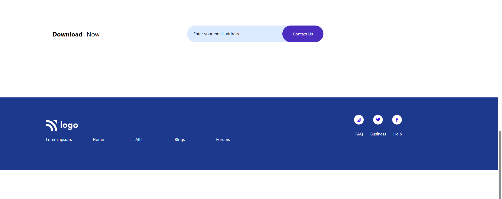

# tailwind css project developer

````md
# NewDeveloper Landing Page

## Overview
This project is a responsive landing page built using **HTML** and **Tailwind CSS**. It includes multiple sections such as navigation, hero banner, categories, blog articles, contact section, download CTA, and footer.

## Features

- Responsive navigation bar
- Hero section with image and intro text
- Company partners section
- APLs by category cards
- Latest blog article section
- Contact / Question section
- Email download CTA
- Footer with links and social icons
- Tailwind CSS utility styling
- Font Awesome icons

[live@](https://jishnusmanoj2004-gif.github.io/developer-project2/)




## Technologies Used

- HTML5
- Tailwind CSS (CDN)
- Font Awesome 7

## Folder Structure

```bash
project-folder/
│── index.html
│── README.md
│── Logo.png
│── IMAGE HERE.png
│── Rectangle.png
│── Rectangle Copy.png
│── Group 97.png
│── Group 98.png
│── Group 99.png
│── Group 100.png
│── Group 101.png
│── Group 102.png
│── Group 103.png
│── Group 104.png
````

## How to Run

1. Download or clone the project.
2. Keep all image assets in the same folder as `index.html`.
3. Open `index.html` in any browser.

## CDN Links Used

### Tailwind CSS

```html
<script src="https://cdn.jsdelivr.net/npm/@tailwindcss/browser@4"></script>
```

### Font Awesome

```html
<link rel="stylesheet" href="https://cdnjs.cloudflare.com/ajax/libs/font-awesome/7.0.1/css/all.min.css">
```

## Sections Included

### 1. Navbar

Contains:

* Logo
* Home
* AIPs
* Blogs
* Forums
* Login
* Sign Up button
* Search icon

### 2. Hero Section

* Intro heading
* Paragraph text
* Right side image

### 3. Company Section

Displays partner company names.

### 4. Categories Section

Shows cards for:

* Identity & Security
* Data & Analytics
* Commercial
* Offers & Benefits
* Payment Methods

### 5. Blog Section

Includes two latest blog cards with author names.

### 6. Contact Section

Question prompt with CTA button.

### 7. Download Section

Email input style CTA with button.

### 8. Footer

Contains:

* Logo
* Navigation links
* Social media icons
* FAQ / Business / Help links

## Improvements Recommended

* Fix spelling mistakes:

  * `Benifits` → `Benefits`
  * `loyality` → `loyalty`
  * `coustome-made` → `custom-made`

* Replace placeholder images with real assets.

* Improve responsiveness for mobile devices.

* Use semantic HTML tags.

* Add real form input for email section.

* Optimize spacing values.

* Add hover transitions.

## Author

Created for practice using HTML + Tailwind CSS.

## License

Free to use for learning and personal projects.

```
```
